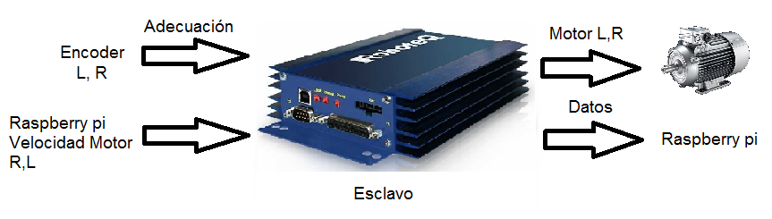
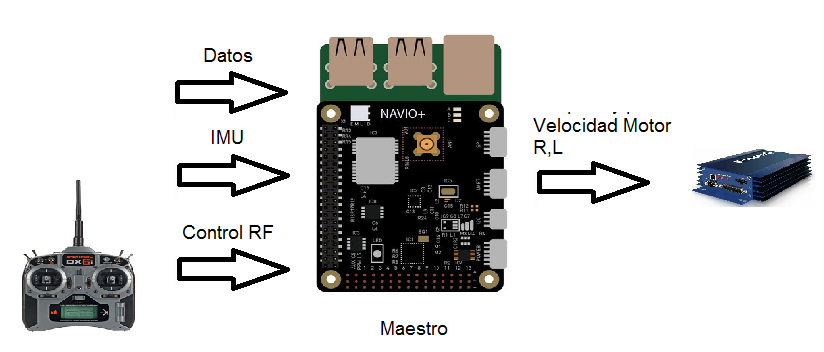
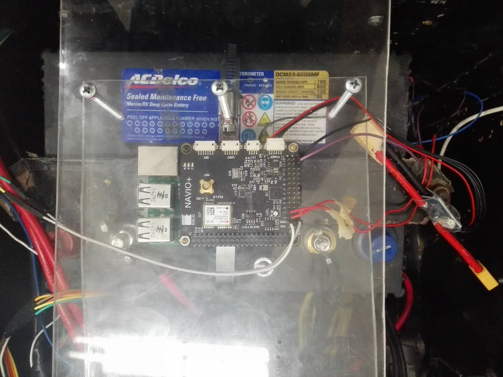
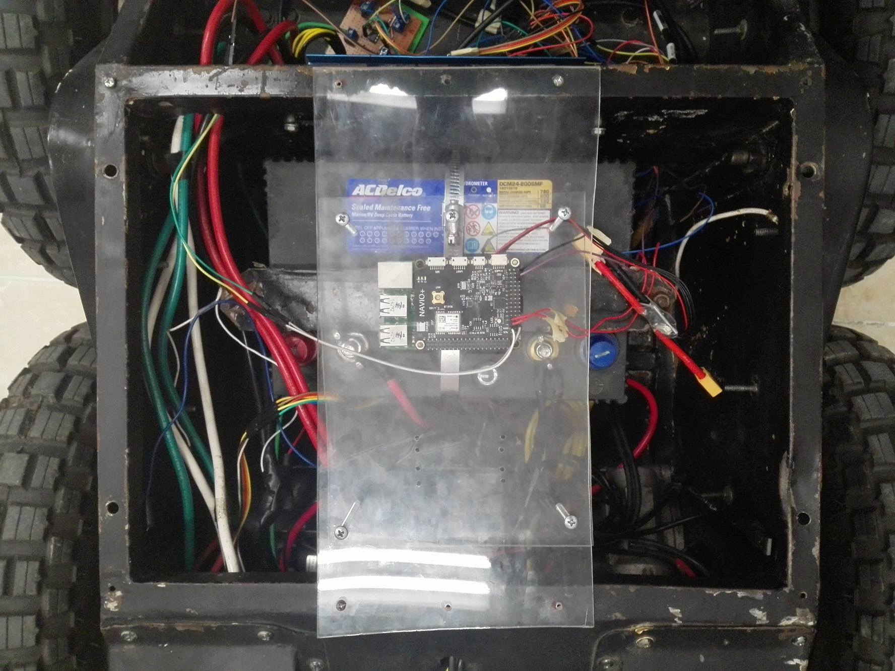
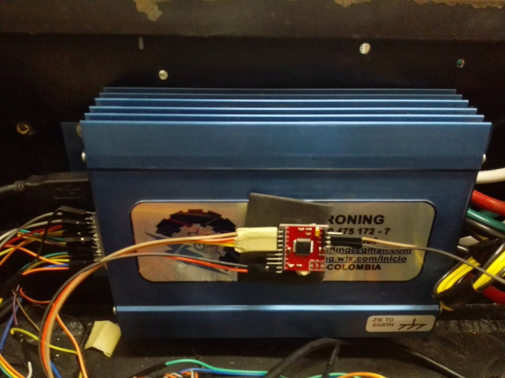
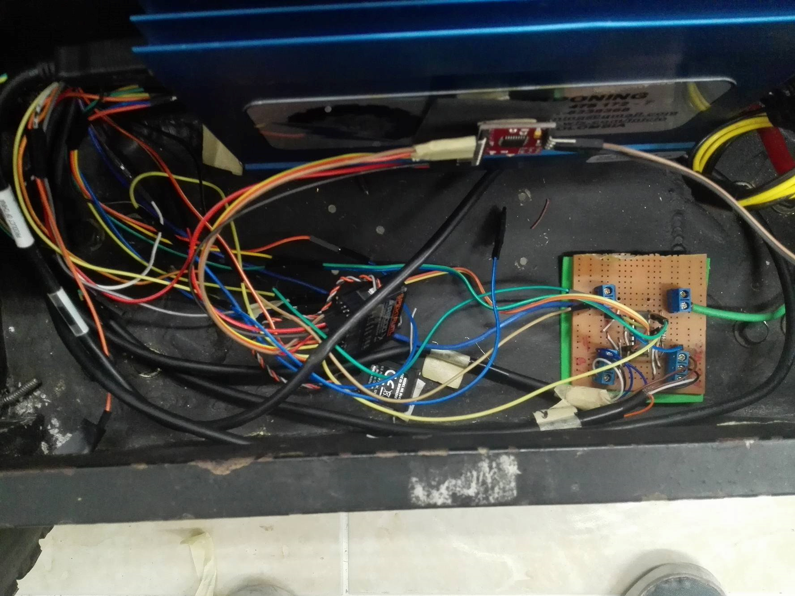
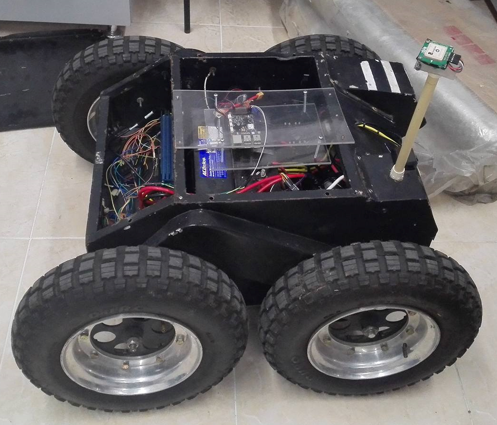
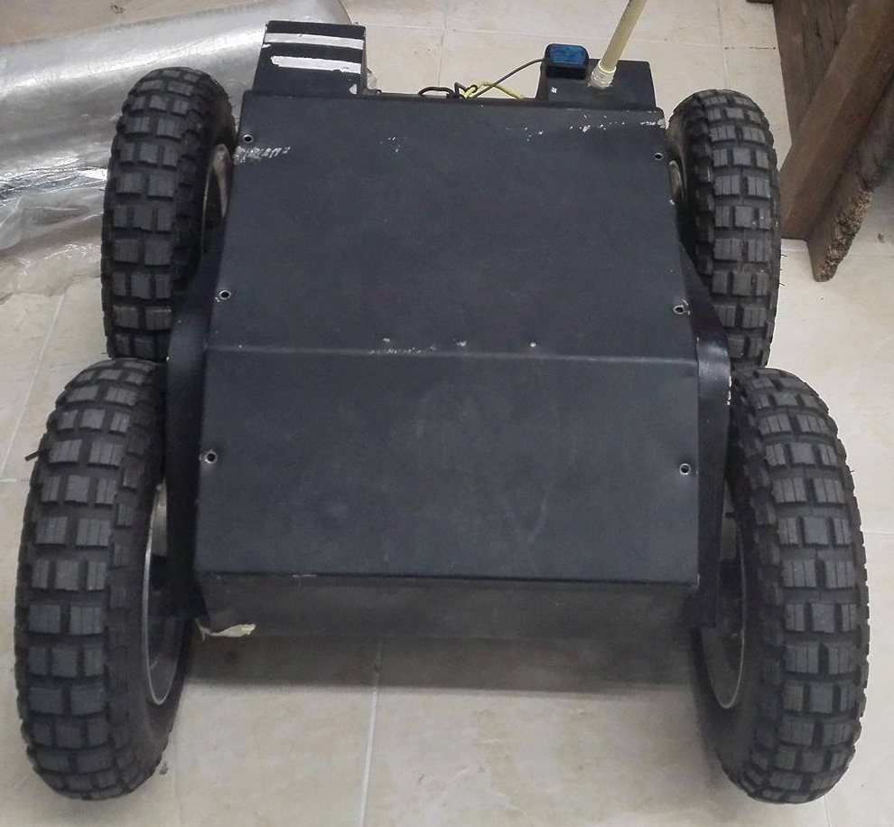

# Rover

El Rover esta compuesto por una armadura metalica, dos motores, dos cadenas, un Rasberry pi 2, un modulo de potencia Roboteq. Se mostrada graficamente como esta constituido el Rover.

Entradas y salidas del sistema exclavo (Roboteq).

Entradas y salidas del sistema maestro (Raspberry pi).

La Raspberry Actúa como tarjeta master, es el cerebro de todo, se hacen todos los cálculos de control, recepción del control RF y acción sobre los motores, el Roboteq es un dispositivo esclavo, solo se le hacen peticiones de información, recolecta la información y posteriormente se envía por USB a la rapsberry Pi la cual está esperando la información.

<table class="default">
  <tr>
    <td></td>
    <td></td>
  </tr>
  
  <tr>
    <td></td>
    <td></td>
  </tr>
  
  <tr>
    <td></td>
    <td></td>
  </tr>
</table>

